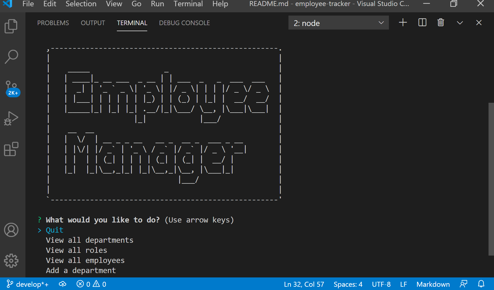
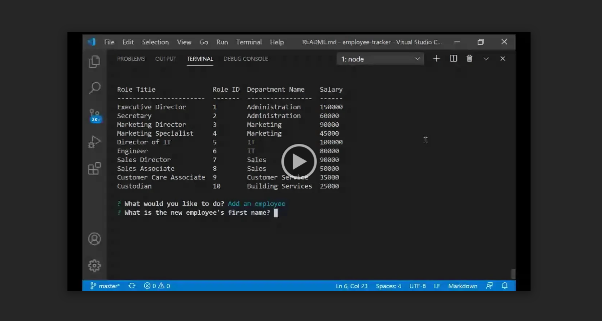

# Employee Tracker

## Description
This application interacts with the user through the command line. Users can view departments, roles and employees within a company. They can also add new departments, roles and employees. Finally, users can update a given employee's role.
  
## Table of Contents
* [Installation](#installation)
* [Usage](#usage)
* [License](#license)
* [Questions](#questions)
 
## Installation
Clone the repository via GitHub and install all dependencies with "npm install".

## Usage
Launch the application with the command "npm start". 

Upon launch, the user will be prompted to select from a list of options. 

When the user selects 'View all departments', 'View all roles' and 'View all employees', a table will display all records.

When the user selects 'Add a department', the user will be prompted to enter a department name, the department will be assigned a unique department id, and will be added to the database.

When the user selects 'Add a role', the user will be prompted to enter a title and salar for the new role, then will be prompted to select from a list of available departments. The new role will be assigned a unique role id, and will be added to the database.

When the user selects 'Add an employee', the user will be prompted to enter a first and last name for the new employee, then will be prompted to select from a list of available roles and available managers. The new employee will be assigned a unique employee id, and will be added to the databse. 

When the user selects 'Update an employee's role', the user will be prompted to select from a list of available employees, then select from a list of available roles. The selected employee's role will be updated accordingly, and the new role will be saved in the database. 

When the user selects 'Quit', the application will exit.

## License
This project is licensed under a ISC License license. 

## Questions
Have additional questions? Contact [cjacktwil](http://github.com.cjacktwil) or email traceyjackson112@gmail.com.
